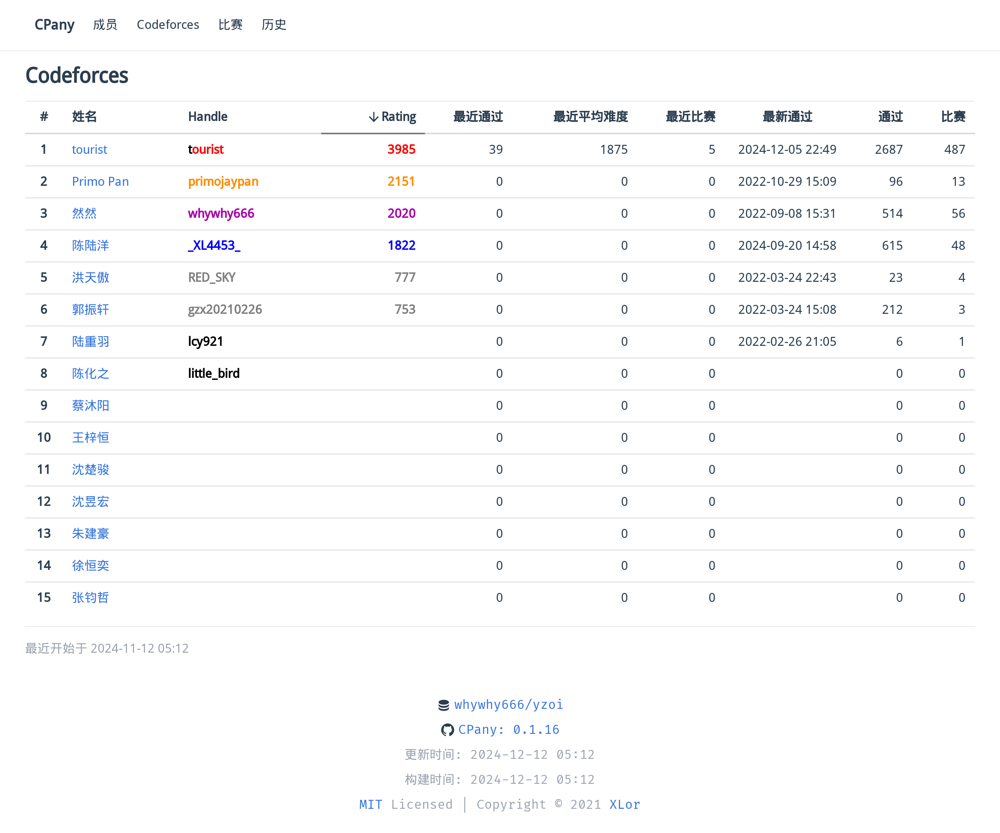

# CPany Data Repo

[](https://www.npmjs.com/package/@cpany/cli)

<!-- START_SECTION: update_time -->
更新时间：[2025-03-02 05:11](https://www.timeanddate.com/worldclock/fixedtime.html?msg=Fetch+data&iso=202503021740863481000051121&p1=237)
<!-- END_SECTION: update_time -->



## Getting Started

Use CPany template [@yjl9903/CPany-Template](https://github.com/yjl9903/CPany-Template) to create your own repository for data storage.

Update config file `cpany.yml`, and push the changes to Github. Then, Github Actions will automatically fetch data and push to your repository.

You can use Netlify, Vercel, Github Pages, etc. to deploy generated static site.

### Netlify Deploy

The template repository has provided Netlify config file `netlify.toml` with the following content.

```toml
[build.environment]
  NODE_VERSION = "14"

[build]
  publish = "dist"
  command = "npm run build"

[[redirects]]
  from = "/*"
  to = "/index.html"
  status = 200
```

Then you can just create a new CPany site with your repository on Netlify.

### Vercel Deploy

The template repository has provided Vercel config file `Vercel.json` with the following content.

```json
{
  "rewrites": [
    { "source": "/(.*)", "destination": "/index.html" }
  ]
}
```

Then you can just create a new CPany site with your repository on Vercel.

### Github Pages Deploy

The template repository has also provided a workflow `gh-pages.yml`, which will automatically push the generated static site to the branch `gh-pages`. You can just enable Github Pages in the Settings of your repository.

### Run locally

Install [Node.js >= 14](https://nodejs.org/).

Run one of the following commands to install [@cpany/cli](https://www.npmjs.com/package/@cpany/cli) globally.

```bash
# npm
npm i -g @cpany/cli

# yarn
yarn global add @cpany/cli
```

Create an empty foler, and create `cpany.yml` in this new folder.

```bash
# prepare folder
mkdir cpany-data
cd cpany-data
echo "users:" > cpany.yml
echo "  tourist:" >> cpany.yml
echo "    codeforces/handle: tourist" >> cpany.yml
```

Fetch data, and start your static site.

```bash
# fetch data
cpany action

# Start dev server
cpany dev

# Build static site
cpany build
```

## License

MIT License © 2021 [XLor](https://github.com/yjl9903)
